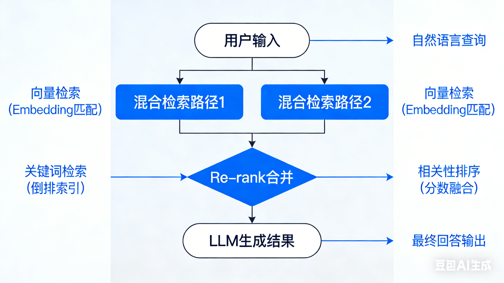

# RAG和向量数据库milvus
## RAG是啥
RAG是让⼤语⾔模型 (LLM) 在回答问题或⽣成内容之前,先从⼀个外部的知识库⾥“查找资料”,然后再结合查到的资料和它⾃⼰的知识来给出答案.
## RAG的流程
我让豆包生成了一个企业rag的流程图  

总体流程就是先去对原始文档进行数据清洗、分块然后得到的chunk(就是分块的结果) 做embedding（他们叫嵌入就是向量化的意思），插入向量数据的时候可以顺便添加他们的元数据（matedata）,类似于打标签，然后可以建索引。等真的查询的时候 将原始语义先进行embedding然后根据元数据先过滤一遍判否，然后根据向量的相似度计算结果找出最相似的top-k，然后可以进行重排序（在top-k里面重新打分、排序，提升可用性），最后llm结合向量数据库给他返回的top-k和用户的prompt里面的约束、输出格式还有实际的需求 在做整合和输出
## 外部知识库-向量数据库
### 常见的向量数据库
1. Milvus: 功能丰富，社区活跃，支持多种索引和高可用部署。  
2. Qdrant: Rust 编写，性能优秀，注重可靠性和易用性。  
3. Chroma: Python 优先，专为 AI 应用设计，易于上手，适合快速原型。  
4. Weaviate: 支持图结构的向量数据库，支持模块化，提供 GraphQL API。  
5. Pinecone: 商业托管服务，易用性好，专注性能和开发者体验。  
项目实例用的第一种 然后后面两种适合快速学习 生产环境的话适合145
### 向量数据库Milvus的用法
1. 建立embedding
``` python
from pymilvus import model as milvus_model

# OpenAI国内代理 https://api.apiyi.com/token 
embedding_model = milvus_model.dense.OpenAIEmbeddingFunction(
    model_name='text-embedding-3-large', # Specify the model name
    api_key='sk-xxx', # Provide your OpenAI API key
    base_url='https://api.apiyi.com/v1',
    dimensions=512 #建立的维度
)
```
2. 创建数据库（collection）
``` python
from pymilvus import MilvusClient

# 将数据库存在这个文件里面
milvus_client = MilvusClient(uri="./milvus_demo.db")

collection_name = "mfd_collection"
# 有就drop库
if milvus_client.has_collection(collection_name):
    milvus_client.drop_collection(collection_name)
# 建库
milvus_client.create_collection(
    collection_name=collection_name,
    dimension=embedding_dim,
    metric_type="IP",  # 内积距离
    consistency_level="Strong",  # 支持的值为 (`"Strong"`, `"Session"`, `"Bounded"`, `"Eventually"`)。更多详情请参见 https://milvus.io/docs/consistency.md#Consistency-Level。
)
```
3. 插入数据
``` python
from tqdm import tqdm

data = []

doc_embeddings = embedding_model.encode_documents(text_lines)
# 插入id、vector（向量）、text（原始内容）
for i, line in enumerate(tqdm(text_lines, desc="Creating embeddings")):
    data.append({"id": i, "vector": doc_embeddings[i], "text": line})

milvus_client.insert(collection_name=collection_name, data=data)
```
4. 将输入的查询语义转换成向量
``` python
search_res = milvus_client.search(
    collection_name=collection_name,
    data=embedding_model.encode_queries(
        [question]
    ),  # 将问题转换为嵌入向量
    limit=3,  # 返回前3个结果
    search_params={"metric_type": "IP", "params": {}},  # 内积距离
    output_fields=["text"],  # 返回 text 字段
)

import json
# 解析搜索结果
retrieved_lines_with_distances = [
    (res["entity"]["text"], res["distance"]) for res in search_res[0]
]
print(json.dumps(retrieved_lines_with_distances, indent=4))

# 转成字符串格式
context = "\n".join(
    [line_with_distance[0] for line_with_distance in retrieved_lines_with_distances]
)
```
5. 调用大模型
```

from openai import OpenAI

deepseek_client = OpenAI(
    api_key=api_key,
    base_url="https://api.deepseek.com/v1",  # DeepSeek API 的基地址
)

SYSTEM_PROMPT = """
Human: 你是一个 AI 助手。你能够从提供的上下文段落片段中找到问题的答案。
"""
USER_PROMPT = f"""
请使用以下用 <context> 标签括起来的信息片段来回答用 <question> 标签括起来的问题。最后追加你对这个法条的理解，并写在我的理解：后面。
<context>
{context}
</context>
<question>
{question}
</question>
<translated>
</translated>
"""

response = deepseek_client.chat.completions.create(
    model="deepseek-chat",
    messages=[
        {"role": "system", "content": SYSTEM_PROMPT},
        {"role": "user", "content": USER_PROMPT},
    ],
)
print(response.choices[0].message.content)
```