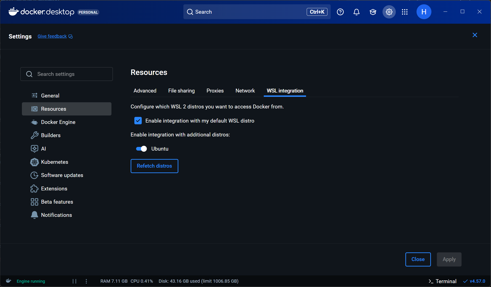
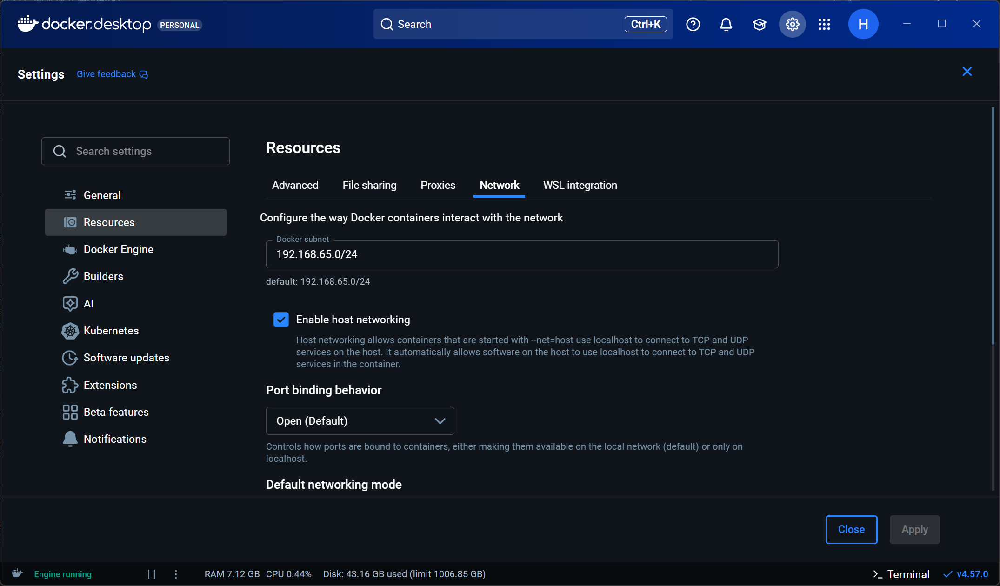
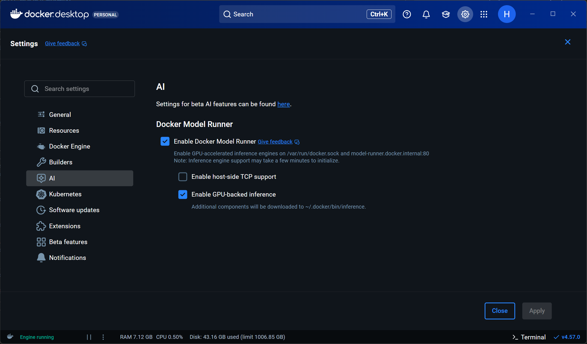
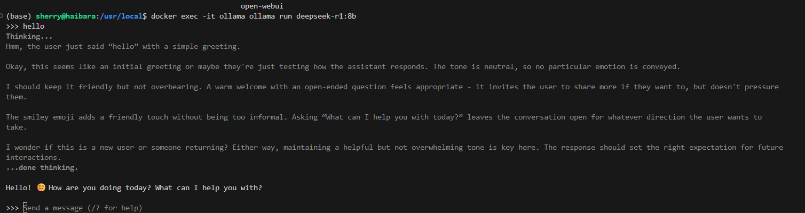
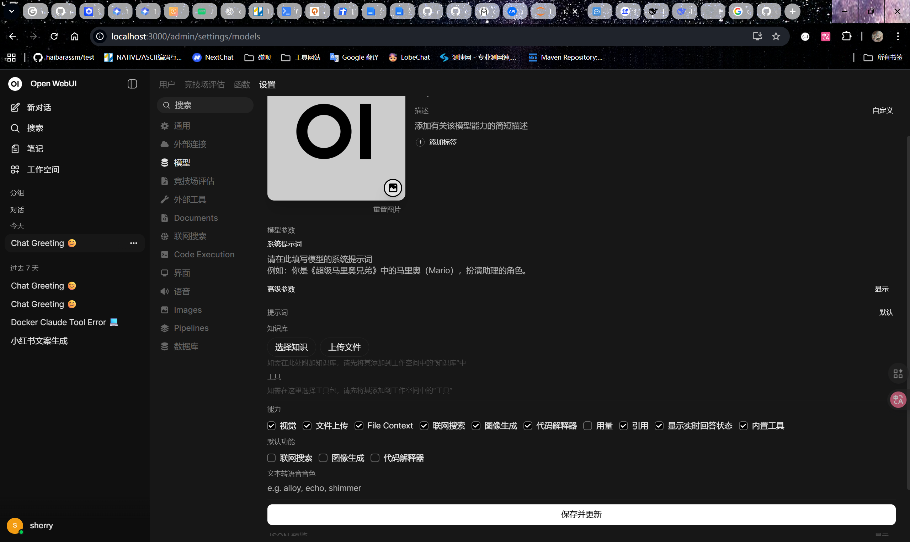
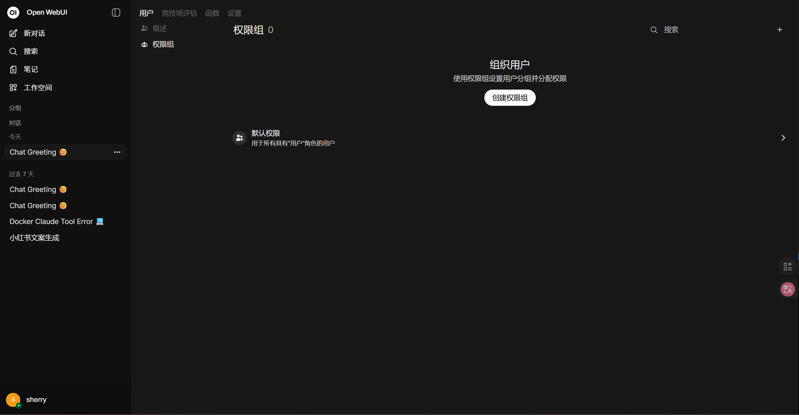

# 搭建自己的本地开源openai
## 基本的组件
用到的是open-webui和ollama这两个开源框架  
推荐都是用docker部署 部署细节和推荐的服务器后面再说
### github地址
open-webui:https://github.com/open-webui/open-webui  
ollama:https://github.com/ollama/ollama
## 机器选择
### 显卡
#### gpu的场景选择
因为现在的大模型都是走的矩阵运算，所以是需要gpu的算力的。那么这么多家gpu对算力支持的最好的是英伟达的gpu，因为他们开发了cuda这样的工具可以优化矩阵运算的速度，而且他们也有自己的技术解决gpu的显存屏障。相对于mac和adm的显卡英伟达的显卡其实表现是要好很多的，而且现在cuda这个工具对于mac和adm的使用限制也越来越多了。
#### 显存的大小选择
真正的满血大模型拿deepseek来说都是deepseek-r1:671b,这种是需要多张a100那样的生产级显卡才能跑得起来的，成本很高。  
本地化部署一般使用的都是大模型蒸馏出来的小模型，甚至是小模型的量化版本，比如  deepseek-r1:8b。这样的版本现在只要是消费级的显卡就可以跑起来。  
按照deepseek-r1:8b为例，推荐的显存在12g以上（我买的12g的）。  
原因是他这个版本的模型大小是5.2GB，就是拉取的初始大小就是5.2GB，然后因为现在的推理模型用的是稠密模型 所以运行时就是需要占用那么多的。然后大模型在运行的时候还需要预留一部分显存用来支持上下文的缓存（k-v cache）
#### 操作系统的选择
首推linux 因为现在这些大模型真的要用肯定都是以docker和k8s这些服务器标准部署的 那些底层都是用的linux  
就拿我自己在用的wins来说 虽然有wsl(linux for windows)做兼容 但是还是会存在docker直接在wsl里面部署的网络问题 以及docker desktop和宿主机（wsl）的一些通信问题 但是现在市面上也买不到linux系统带英伟达显卡的电脑不是  
云服务器确实有英伟达显卡甚至是生产机的显卡选择 那不是贵嘛 而且最好还是选国外的服务器 不然很多镜像也会出现网络问题 可是真的挺贵的 我看华为2200+ 阿里云3000+
## 部署
下面的都是按照linux的ubuntu系统来 因为我是装的dockerdesktop 所以我就跳过docker安装步骤了 
### docker 安装
```
# 更新软件包索引
sudo apt-get update

# 安装依赖包
sudo apt-get install -y ca-certificates curl

# 安装 Docker
sudo apt-get install -y docker.io

# 验证 Docker 是否安装成功
sudo docker run hello-world
```
### 前置条件
1. 安装cuda插件（华为云自带）
```
wget https://developer.download.nvidia.com/compute/cuda/12.4.0/local_installers/cuda_12.4.0_550.54.14_linux.run
sudo sh cuda_12.4.0_550.54.14_linux.run
```
成功安装输出日志如下：
```
===========
= Summary =
===========

Driver:   Installed
Toolkit:  Installed in /usr/local/cuda-12.4/

Please make sure that
 -   PATH includes /usr/local/cuda-12.4/bin
 -   LD_LIBRARY_PATH includes /usr/local/cuda-12.4/lib64, or, add /usr/local/cuda-12.4/lib64 to /etc/ld.so.conf and run ldconfig as root

To uninstall the CUDA Toolkit, run cuda-uninstaller in /usr/local/cuda-12.4/bin
To uninstall the NVIDIA Driver, run nvidia-uninstall
Logfile is /var/log/cuda-installer.log
```
安装完成后，使用 nvidia-smi 指令查看版本：
```
Thu Jan 22 16:37:06 2026       
+-----------------------------------------------------------------------------------------+
| NVIDIA-SMI 590.52.01              Driver Version: 591.74         CUDA Version: 13.1     |
+-----------------------------------------+------------------------+----------------------+
| GPU  Name                 Persistence-M | Bus-Id          Disp.A | Volatile Uncorr. ECC |
| Fan  Temp   Perf          Pwr:Usage/Cap |           Memory-Usage | GPU-Util  Compute M. |
|                                         |                        |               MIG M. |
|=========================================+========================+======================|
|   0  NVIDIA GeForce RTX 5070 ...    On  |   00000000:01:00.0  On |                  N/A |
| N/A   52C    P2             27W /  115W |    2765MiB /  12227MiB |      0%      Default |
|                                         |                        |                  N/A |
+-----------------------------------------+------------------------+----------------------+

+-----------------------------------------------------------------------------------------+
| Processes:                                                                              |
|  GPU   GI   CI              PID   Type   Process name                        GPU Memory |
|        ID   ID                                                               Usage      |
|=========================================================================================|
|    0   N/A  N/A               1      C   /python3.11                           N/A      |
|    0   N/A  N/A              25      G   /Xwayland                             N/A      |
|    0   N/A  N/A              41      G   /Xwayland                             N/A      |
+-----------------------------------------------------------------------------------------+
```
使用nvcc --version可以查看wsl实际的版本
```
nvcc: NVIDIA (R) Cuda compiler driver
Copyright (c) 2005-2024 NVIDIA Corporation
Built on Tue_Feb_27_16:19:38_PST_2024
Cuda compilation tools, release 12.4, V12.4.99
Build cuda_12.4.r12.4/compiler.33961263_0
```
因为我自己是wins就是最新的cuda版本 所以wsl里面是跟wins一样的 如果是真的云服务器 其实就是你装的那个  
2. 安装 NVIDIA Container Toolkit
```
# 添加软件源
curl -fsSL https://nvidia.github.io/libnvidia-container/gpgkey | sudo gpg --dearmor -o /usr/share/keyrings/nvidia-container-toolkit-keyring.gpg
curl -s -L https://nvidia.github.io/libnvidia-container/stable/deb/nvidia-container-toolkit.list | \
  sed 's#deb https://#deb [signed-by=/usr/share/keyrings/nvidia-container-toolkit-keyring.gpg] https://#g' | \
  sudo tee /etc/apt/sources.list.d/nvidia-container-toolkit.list

# 更新软件包列表
sudo apt-get update

# 安装 NVIDIA Container Toolkit
sudo apt-get install -y nvidia-container-toolkit

# 配置 Docker 使用 NVIDIA 运行时
sudo nvidia-ctk runtime configure --runtime=docker

# 重启 Docker 服务
sudo systemctl restart docker
```
wsl配置的时候 后面两步是在docker desktop里面设置的  反正我当时重启都是直接在docker desktop里面操作的 ubuntu里面重启是没反应的



### Ollama 安装部署与服务发布
ollama也有两种方式 一种是直接在linux（wsl）里面 一种是部署在docker里面 我试过这两种 然后发现如果是在docker里面他的响应速度会快很多 应该还是和文件映射还有网络有关系
部署完之后长这样

#### 直接在linux上部署
1. 安装命令
```
curl -fsSL https://ollama.com/install.sh | sh
```
2. 等他自己跑完 然后你可以给他注册一个service 来做管理
3. 看看有木有设备文件 我反正看到过安装好之后 启动不了 然后让deepseek排查 没有这个文件
```
 "4. 创建设备文件（确保权限）..."
sudo chmod 666 /dev/nvidia* 2>/dev/null || true
```
3. 安装完之后就可以找你想要的模型 启动了 
启动命令是类似于这样的
```
ollama run deepseek-r1:8b
```
这一步就是看看你本地有木有这个模型，没有的话先拉取 再运行  
ollama对于的模型地址是https://ollama.com/library
#### 在docker里面安装
1. 安装命令
```
docker run -d --gpus=all -v ollama:/root/.ollama -p 11434:11434 --restart always --name ollama ollama/ollama
```
 --gpus=all就是启动gpu加速
2. 启动命令
```
docker exec -it ollama ollama run deepseek-r1:8b
```
或者你进到ollama容器 跑上面linux的命令
### Open WebUI 安装部署与服务发布
### 几种部署方式
1. 默认配置（Ollama 在同一台计算机上）    
如果 Ollama 服务运行在同一台计算机上，使用以下命令：
```
docker run -d -p 3000:8080 --add-host=host.docker.internal:host-gateway \
  -v open-webui:/app/backend/data \
  --name open-webui \
  --restart always \
  ghcr.io/open-webui/open-webui:main
```
2. Ollama 在另一台服务器上  
要连接到另一台服务器上的 Ollama，请将 OLLAMA_BASE_URL 环境变量设置为该服务器的 URL：
```
docker run -d -p 3000:8080 \
  -e OLLAMA_BASE_URL=https://example.com \
  -v open-webui:/app/backend/data \
  --name open-webui \
  --restart always \
  ghcr.io/open-webui/open-webui:main
```
3. [重点关注]使用 Nvidia GPU 支持运行 Open WebUI  
要使用 Nvidia GPU 支持运行 Open WebUI，请使用以下命令：
```
docker run -d -p 3000:8080 \
  --gpus all \
  --add-host=host.docker.internal:host-gateway \
  -v open-webui:/app/backend/data \
  --name open-webui \
  --restart always \
  ghcr.io/open-webui/open-webui:cuda
```
我跑的版本就是用的这个 docker还是wsl都是一样的  
4. [重点关注]安装捆绑 Ollama 的 Open WebUI（一体式安装）  
这种方法使用一个容器镜像，该镜像捆绑了 Open WebUI 和 Ollama，允许通过单个命令进行设置。根据您的硬件配置选择适当的命令：
```
docker run -d -p 3000:8080 \
  --gpus=all \
  -v ollama:/root/.ollama \
  -v open-webui:/app/backend/data \
  --name open-webui \
  --restart always \
  ghcr.io/open-webui/open-webui:ollama
```
这个我没试  我觉得还是拆开来更好一些
#### 访问 Open WebUI
安装完成后，您可以通过 http://localhost:3000 访问 Open WebUI。
#### 页面配置
1. 刚打开反正会让你初始化 设置账号密码什么的
2. 打开你的管理员面板-设置-模型 选择你跑的那个模型 然后做一些模型设置

3. 如果有其他人用的话你也可以在这里做权限管理

## 结合的原因
1. open-webui 可以更好的管理模型 可以通过图形界面下载新的模型
2. 更方便的使用一些多模态的能力（就是文字、语音、图片都可以作为输入或者输出），当然还是要看你下载的模型支持不支持 deepseek-r1:8b这个我试了不支持图片+mcp的
3. 那不是多个页面好操作嘛  而且也有一些权限的管理