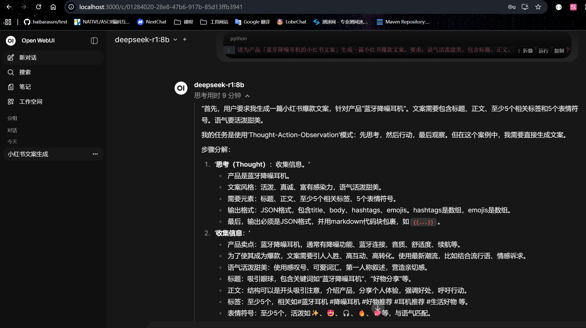
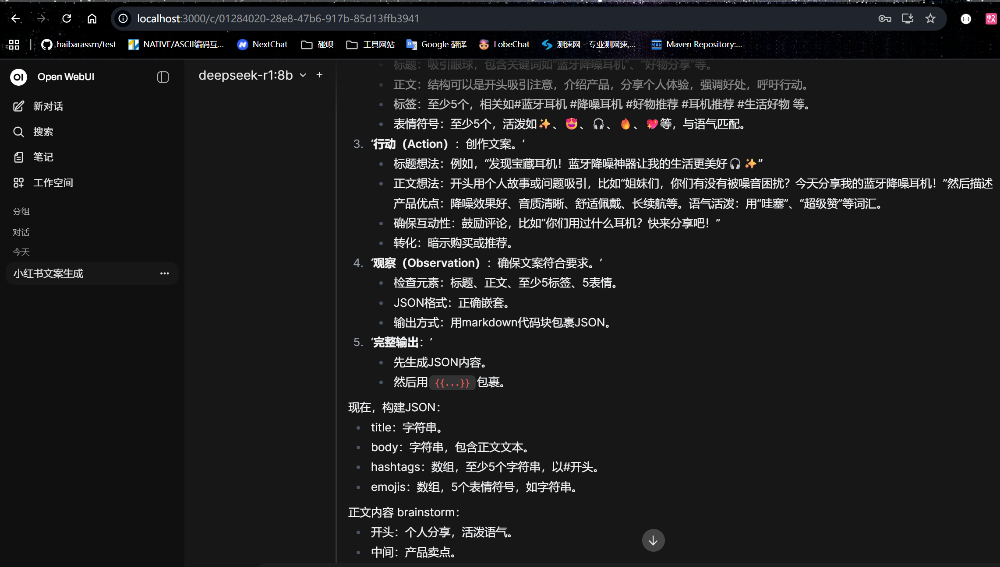
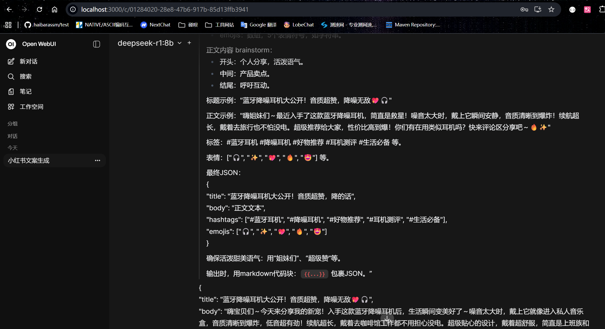
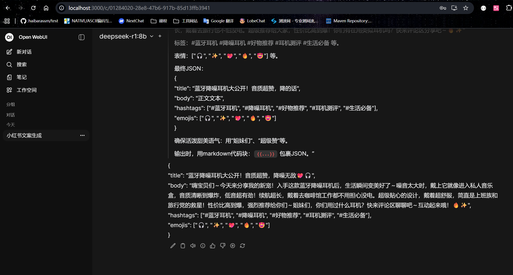
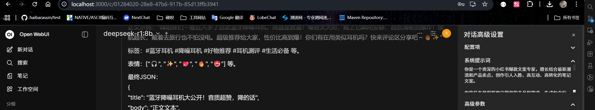
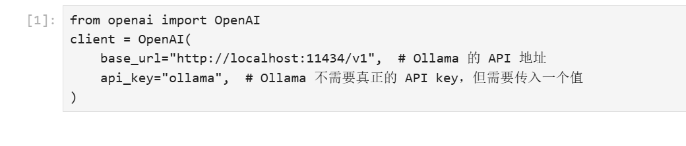
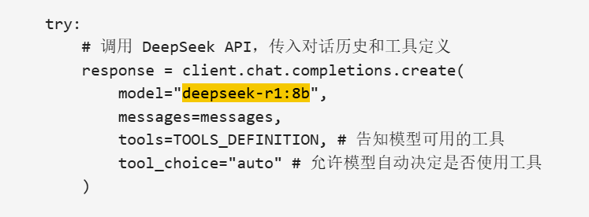
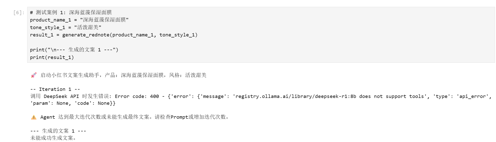

## 第一题 deepseek思考和答案截图

## 第二题 修改小红书的deepseek来源 支持私有化模型
### github链接
https://github.com/haibarassm/deepseek-quickstart/blob/main/deepseek/rednote/rednote.ipynb
### 修改和问题截图
#### 修改的一共是两个地方
##### 初始化地方

##### 调用的地方

### 问题截图
