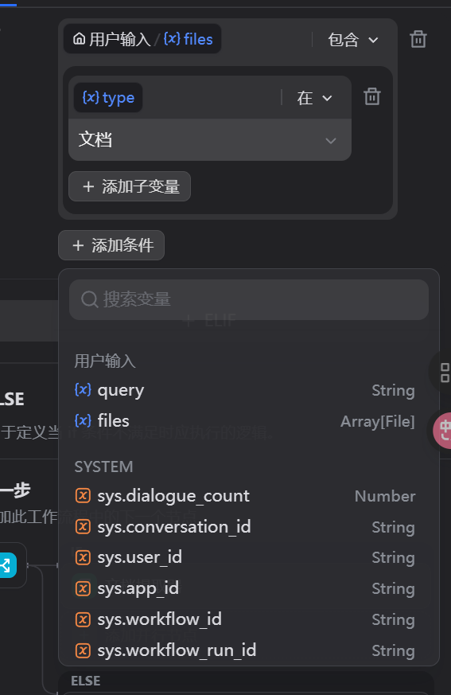
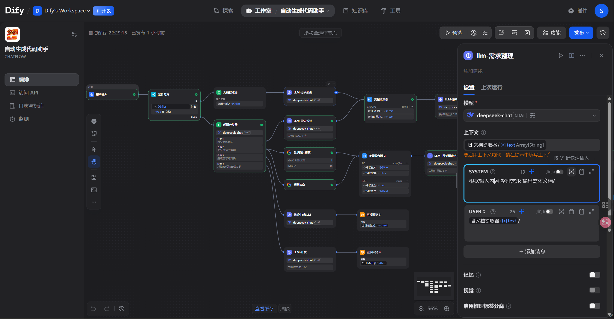
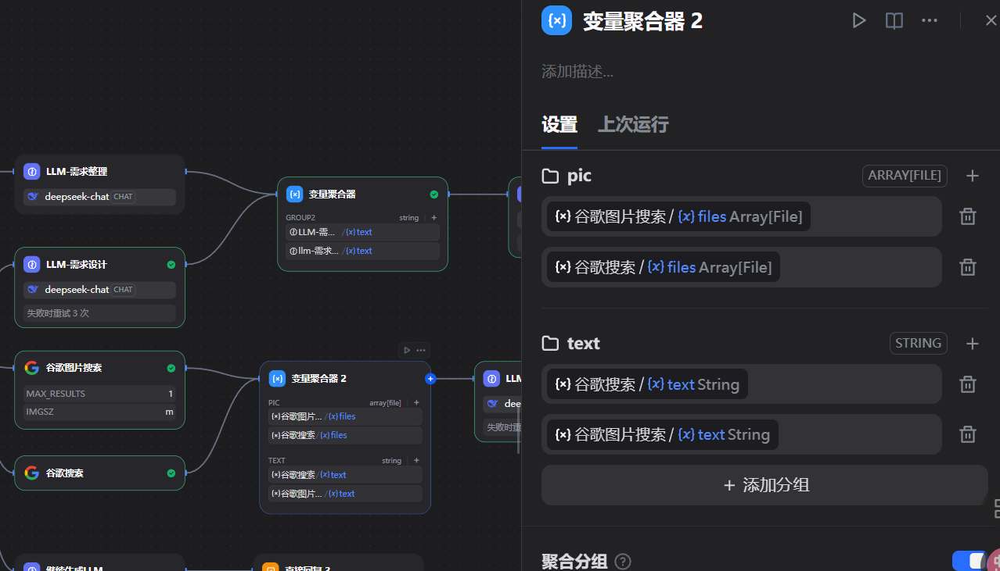
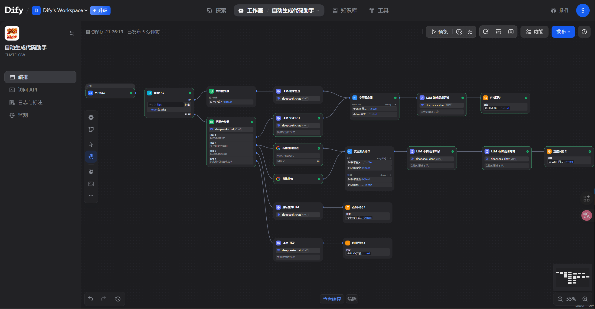
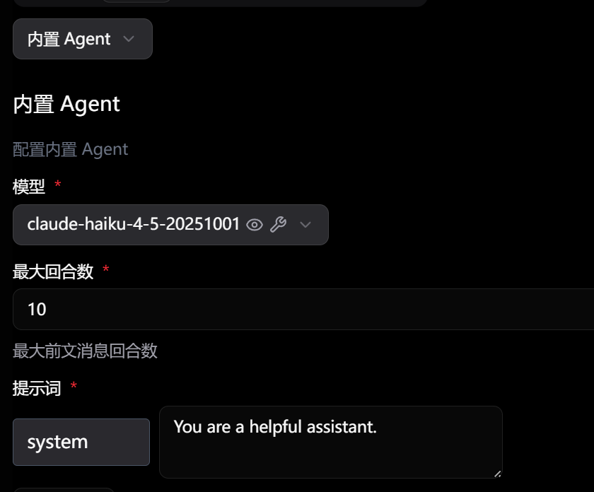
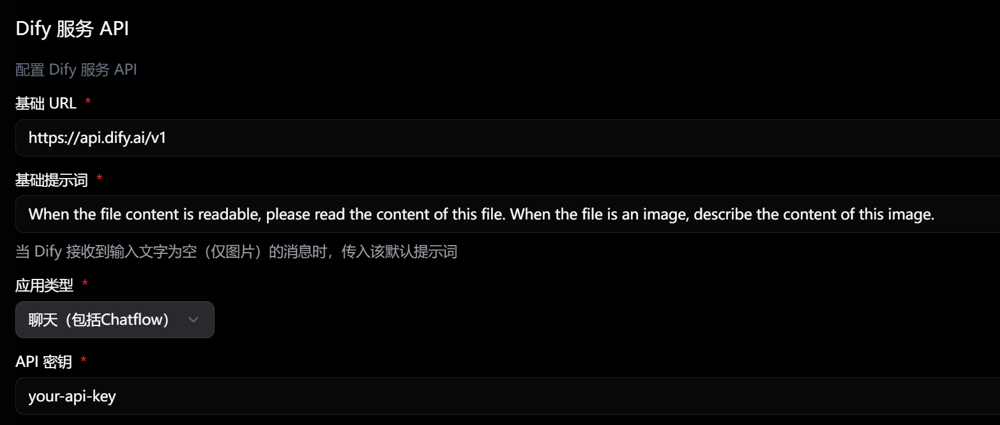
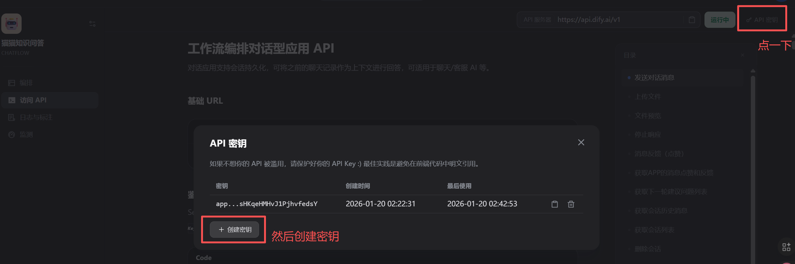

# 大模型应用组件dify+langbot整理
## 平台介绍
### dify
   dify是一个开源的项目，是一个大模型编排的平台。  
整合了rag(知识库)、工具（dify平台上可以安装的工具\mcp），可以根据你的需求快速的实现大模型的开发。  
主要是用途是和langbot结合做IM即时通信客服，跟知识库结合做特定领域的rag,或者结合一些平台提供的工具配置一些自动化的流程。  
现在支持私有化部署、亚马逊托管的企业云服务和dify自己的云平台（免费玩5个哦）。
### langbot
langbot是一个开源的即时通信中心 ，可以快速构建、调试、部署即时通信机器人。  
现在已经接通了钉钉、企业微信、飞书、微信、qq等一些常用的IM工具。  
你在服务器或者本地部署完之后，去各个平台拿各自的配置，然后配置模型、公用的流水线和各自的机器人就可以实现一套流水线在多个im平台投放了，对于那些网店客服真的很合适了。
## 部署的步骤
### dify私有化部署
1.  **克隆 Dify 代码仓库** (如果网络慢，请使用上一节的 Git 加速方法)
    ```bash
    git clone https://github.com/langgenius/dify.git
    ```
2.  **启动 Dify**
    ```bash
    cd dify/docker
    cp .env.example .env
    docker compose up -d
    ```
3.  **访问**：在浏览器中打开 `http://localhost/install` 或 `http://your_server_ip/install` 进行初始化。  
不过我部署下来有点问题 他说少了必要的文件 下午再看看
### LangBot
1.  **克隆 LangBot 代码仓库**
    ```bash
    # 回到上一级目录，或任意您选择的目录
    cd ../.. 
    git clone https://github.com/RockChinQ/LangBot
    ```
2.  **启动 LangBot 服务**
    ```bash
    cd LangBot
    docker compose up -d
    ```
然后打开你的http://localhost:5300/    
一开始进去会让你初始化，我发现我每次重启docker都会让你初始化 应该是wsl的问题 毕竟谁家云服务器老是重启

## 主要操作步骤和组件
### dify
#### 知识库搭建步骤
1. 建立知识库
2. 通过导入提供的md文档（或者你其他想玩的东西）
3. 设置Embedding模型 、分段重叠长度、检索召回的topk以及召回的最低阈值去创建知识库 
4. 做召回测试 然后再去调整第三步的那些参数值
#### 工作流的搭建步骤
1. 在设置里面先配置对应的大模型（api_Key）
2. 如果你需要用到工具（就比如google搜索），那你就去工具哪里安装，然后他一般会让你提供一个api_key，一般是有链接的 你点进去注册看看就知道了 
3. 添加空白应用 选择chatfolw（多轮复杂任务）/工作流（单轮任务） 起个名，心情好你就再生成一个logo
4. 添加你要用的对应节点（具体在后面组件里面介绍）
5. 配置各个llm的系统提示词、用户提示词、模型以及模型的参数（比如温度或者上下文长度之类的）
6. 然后你预览看看和你想的一不一样，不行就回5去改参数加节点
7. 你调试完没啥问题就点发布 他会给你一个链接你就可以打开链接拿去玩了 也支持嵌套在代码里面或者用api访问
#### 主要的组件
1. 条件分支
    就是代码里面的if-else那套 ，可以对前序节点的输入或者系统上的一些参数进行条件判断，也可以条件里面添加子变量
    
2. 文档提取器
    就是将用户输入的一些文件转换成字符串给到后续节点
3. 问题分类器
    就是基于语义的条件判断，这里会用大模型来判断用户输入的语义符合哪一个分类 然后不同的分类走不同的流程
4. 单独的llm
    就是调用大模型，然后根据你提供的提示词和设定的上下文来完成任务
    
5. 工具
    平台上有很多可安装的工具 这些工具也是可以通过配置在编排的时候用上的。操作方式是点那个+然后选工具然后选具体的工具节点 就比如google工具有两种一种是google搜索一种是google图片搜索（ps这个Google搜索每个月250次免费次数呢）
    
6. 变量聚合器
    之前的条件分支或者问题分类器在后面如果走了其他的节点 然后现在需要聚合多个节点的输出给到下一个节点作为输入，那么就可以使用变量聚合器。但是这里有一个注意点，就是变量聚合器同一个group必须是同一种类型的节点或者工具的相同输出不然他合不到一起。
    
7. 直接回复
    就是输出指定节点的内容，一般跟在llm后面组合使用
这是我作业搭建的自动生成代码助手，里面包含了上面说到的所有的节点

### langbot
#### 主要步骤
1. 去模型配置里面配置你自己的模型 就是选个供应商再填个api_key
2. 建一个这次用的流水线 推荐是从原来的默认流水线复制，改一改名称、描述和AI能力里面的运行期和提示词  
 这里有几种情况：
  内置的运行器 那就选模型配置最大回合数（防止大模型死循环）
  difyapi 那就除了写基础提示词之外再选应用类型（聊天）配置api密钥 
  dify的api密钥是在
3. 建一个机器人 选平台 然后填那个平台的一堆配置
    我自己实验了两种 企业微信真的事情多（7个配置）飞书是两个 建应用的时候拿就行了
4. 然后提交并且启用之后 再去对应的平台 点一下类似于建立通信的按钮 然后就可以了 

    
