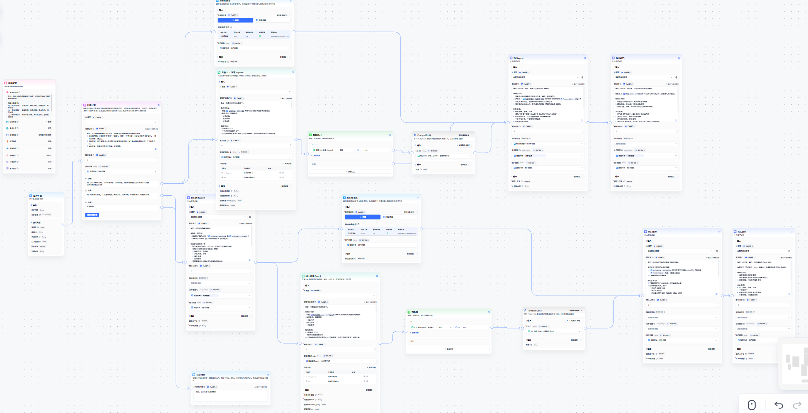

# fastgpt —— 企业级 RAG 开发框架学习整理

> 本文围绕 **企业级 RAG 系统** 展开，重点讨论其相较于 MVP / Demo 级 RAG 所面临的真实问题与工程痛点。
>
> 核心关注点不是“模型能不能回答”，而是：**系统是否可控、可演进、可交付**。

---

## 一、为什么 MVP RAG 无法直接走向企业级

在课程学习与实际拆解过程中，一个非常明确的结论是：

> **MVP RAG 的终点是「模型给了一个看起来不错的答案」，
> 企业级 RAG 的终点是「系统产出了一个可被业务接收的结果」。**

这两者之间，并不是“调一调 Prompt”或“换个更大的模型”就能跨越的。

---

## 二、企业级 RAG 的核心痛点与差异

**这套系统的核心不是 RAG，而是「问题路由 + Agent 编排」。**

RAG 只是其中一类能力节点，用来解决「知识密集型问题」，而不是所有问题的默认入口。

---

## 二、问题类型拆分：不同问题，走不同系统

在真实客服场景中，如果所有问题都丢给同一个 RAG，是不成立的。

在这套设计中，我将问题大致拆为三类，并在 Agent 层完成路由：

### 1️⃣ 知识型问题 → RAG 系统

典型问题：

* 商品规则说明
* 售前 / 售后政策
* 常见 FAQ

处理方式：

* 文档 / 规则进入知识库
* 混合检索（关键词 + 向量）
* 使用 **合适的重排 LLM** 做 rerank

> 这一类问题的关键不在于「多查」，而在于「查对」。

---

### 2️⃣ 数据型问题 → 数据库 / 工具 / SQL

典型问题：

* 订单状态
* 物流信息
* 用户历史记录

处理方式：

* 不进向量库
* 由 Agent 判断后直接调用数据库工具 / SQL Agent

> 对这类问题来说，RAG 只会增加不确定性。

---

### 3️⃣ 混合型问题 → 先查数据，再组织语言

典型问题：
-「我这个订单为什么还没发货？」
-「这个商品我能不能退？」（涉及规则 + 用户订单状态）

处理方式：

1. 先通过工具拿到**确定性数据**
2. 再由 LLM 结合规则进行解释与组织

> 这里 LLM 的角色是「解释者」，而不是「数据来源」。

---

## 三、企业级 RAG 的完整处理流程（包含后置处理）

从整体链路上看，这套流程已经明显不同于“基础版 RAG”：

1. Query 进入系统
2. **Query 预处理 / 分类判断**
3. 根据意图路由到不同 Agent 分支
4. RAG / 数据库 / 工具 / 混合流程
5. Context + Prompt 组装
6. LLM 推理
7. **Answer 后置处理（Post-processing）**：格式规范、规则校验、结构化输出、业务可交付性

其中真正决定系统质量的，不是第 5、6 步，而是前面的 **路由与中间控制点**。

---

## 四、RAG 设计上的几个关键取舍

### 1️⃣ 检索必须是混合检索

* 纯向量：语义强，但不精确
* 纯关键词：精确，但召回不足

实际使用中：

> **关键词负责“别漏”，向量负责“别傻”。**

---

### 2️⃣ 重排比 TopK 更重要

* TopK 拉高 ≠ 质量提升
* 使用合适的 rerank LLM
* rerank 的目标是：**“能不能支撑回答”**，而不是“像不像问题”

---

## 五、FastGPT vs Dify（基于企业级 RAG 视角）

### FastGPT 更适合：

* 多 Agent
* 多分支流程
* 强工具调用
* 明确的工程控制点

优势体现在：

* Workflow / Agent 显式化
* 条件判断是一级能力
* 更接近「Agent 编排平台」

---

### Dify 更适合：

* 快速搭建单一应用
* Prompt + RAG 为主
* 产品形态更完整

> 如果目标是**复杂业务流转**，FastGPT 的结构优势更明显；
> 如果目标是**快速交付一个 AI 应用**，Dify 上手更快。

---

## 六、FastGPT 的部署方式（实践向）

### 1️⃣ Docker Compose 一键部署

适合：学习 / 本地验证

基本步骤：

1. 准备 docker & docker-compose
2. 拉取 FastGPT 官方 compose 文件
``` shell
bash <(curl -fsSL https://doc.fastgpt.cn/deploy/install.sh) --region=cn --vector=pg
# 或者下面的连接 哪个能打开就是哪个
bash <(curl -fsSL https://doc.fastgpt.cn/deploy/install.sh) --region=global --vector=pg
```
3. 配置环境变量（模型 / 向量库 / 鉴权）
4. 启动服务

特点：

* 成本低
* 结构清晰
* 适合理解整体架构

---

### 2️⃣ 开发模式部署

适合：

* 二次开发
* 自定义工具 / Agent

特点：

* 前后端可调试
* 更灵活，但维护成本更高

具体步骤（官方文档连接）：
https://doc.fastgpt.io/docs/introduction/development/intro
```shell
# 打包完成之后的命令(基于硅基流动的api)
docker run -d \
  -p 3000:3000 \
  --name fastgpt-app \
  -v ./data:/app/data \
  -e OPENAI_BASE_URL=https://api.siliconflow.cn/v1 \
  -e CHAT_API_KEY=xxx \
  fastgpt
```
---


### 3️⃣ 商业化一键部署

适合：

* 正式环境
* 权限 / 稳定性要求高的场景

---

## 七、模型与重排模型配置理解

### 1️⃣ 模型角色拆分

* 对话模型：负责理解与生成
* Embedding 模型：负责召回
* Rerank 模型：负责排序

> 三者不需要是同一个模型，也不应该是。

---

### 2️⃣ Rerank 模型的定位

* 成本低于主模型
* 关注相关性判断
* 不追求语言能力

在系统中属于：

> **“质量放大器”**

---

## 八、FastGPT 核心组件在这套系统中的角色

* **Agent / Workflow 显式化**
  → 流程能看见、能调、能回放

* **条件判断 + 工具调用**
  → 模型不是唯一决策者

* **多 Agent 拆职责**
  → 后期维护成本低很多

这些能力共同决定了：

> 这不是一个 Prompt 工程，而是一套系统工程。

---

## 九、整体可观测性与调试

FastGPT 的工作流结构，使得：

* 每一步输入 / 输出都可追踪
* 问题可以被精确定位在某个节点
* 非“黑盒式”调参

这是其非常适合企业级 RAG 的原因之一。

---

## 十、设计图与流程图
> 

* 总体 Agent 流程
* 不同问题分支示意
* RAG / 数据 / 混合路径对比

---

## 十一、阶段性总结

这套系统当前最大的价值不在于“回答得多聪明”，而在于：

* 哪些问题不该进 RAG
* 哪些问题必须走工具
* LLM 在系统中承担的是「理解与调度」角色

> 当 LLM 不再是唯一核心，系统反而变得更稳定。
