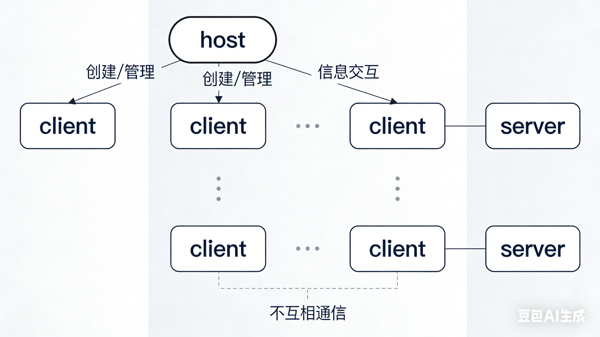

# mcp与a2a
## mcp
### mcp是什么
mcp是agent与资源（本地、远端）交互的一种协议
### mcp的组成部分
prompt、resource、tools  
提示语、资源（本地的一些进程或者远端的一些服务）、资源提供的工具
### mcp的基本python实现
#### mcp的python代码
```python
from mcp.server.fastmcp import FastMCP

# 1. 初始化 FastMCP 服务器
# 创建一个名为 "xxx" 的服务器实例。这个名字有助于识别这套工具。
mcp = FastMCP("xxx")

@mcp.tool()
async def xxx(state: str) -> str:
    """
    对这个工具的描述 (async 加不加都行 不过复杂的任务都是sse形式的)
    这个函数被 @mcp.tool() 装饰器标记，意味着它可以被大模型作为工具来调用。

    参数:
       比如 state: 两个字母的美国州代码 (例如: CA, NY)。
    """
    # todo 具体的逻辑
   
#    todo 结构化的输出
    return str

```
#### mcp的通用配置
```json
{
  "mcpServers": {
    "weather": {
      "type": "stdio",
      "command": "uv",
      "args": [
        "--directory",
        "/home/sherry/project/deepseek-quickstart/mcp/weather",
        "run",
        "weather.py"
      ]
    },
    "filesystem_exc-adm": {
      "type": "stdio",
      "command": "npx",
      "args": [
        "-y",
        "@modelcontextprotocol/server-filesystem",
        "路径"
      ]
    },
    "12306-mcp": {
      "type": "sse",
      "url": "https://mcp.api-inference.modelscope.net/xxx/sse"
    }
  }
}
```
type就是大的两种 一种是sse（远程），一种是stdio（本地）  
本地可能是不同工具写的 所以启动命令会不一样 本质都是去启动这个服务获取资源
### mcp的架构
他是由host/application、client、server组成的。  
拿cursor为例，他自己就是一个host,然后他集成了git的功能。  
比如去拉取远程分支的时候，agent无法直接去掉远端的git有关的接口，所以通过mcp这个协议，跑命令通知client ，给他发任务。然后client再通过sse/stdio 调用server获取资源 真的去做操作

#### mcp的层级
client->协议层->传输层->server
1. 协议层是为了将client给的非结构化的或者多模态的数据解析成json-rpc 2.0的格式或者接收传输层给他的json-rpc数据再解析成语义返回给client
2. 传输层是接收协议层给他的json-rpc数据然后转化成字节流通过sse/stdio的形式传给server，他是实际去发请求/接收响应的那层
#### mcp的通信方式
1. 标准输入输出（Stdio）  
本地进程，对同机通信效率高，进程管理简单
2. SSE（远程通信）  
使用事件 (Server-Sent Events, SSE) 进行流式传输  
需要 HTTP 兼容性的场景，且安全性高（支持认证和授权）
## A2A
### A2A是什么
A2A是不同agent之间互相通信、协作与协商的规则。主要是为了解决信息孤岛、为了应对复杂的agent任务、保护隐私与 IP 。
### A2A的设计思想和规则
1. 拥抱智能体能力
2. 基于现有标准（最大化兼容性与集成便利性）
3. 默认安全（企业级认证和授权设计）
4. 支持长时任务（几天甚至几周）
5. 多模态无关
### A2A的架构
A2A Client->A2A Server->AgentExecutor-》agent  
有一个发布任务的agent，把任务给了A2A Server-，然后A2A Server-根据他现在接收到的agentCard来确定可以调那些能力，再将业务拆解，然后按照步骤去掉具体的AgentExecutor,AgentExecutor根据请求再去掉真正的agent（就比如mcp里面具体的tool）
.png>)
### A2A的通信机制
通信模型：采用 Client- Server 架构    
  1. Client-Agent: 发起任务的 Agent  
  2. Remote-Agent: 接收并执行任务的 Agent（服务）
#### 重要组成
##### Agent Card 
 定义：一个标准化的 JSON 文件，用于声明 Agent 的能力与身份。  
 作用：实现动态能力发现.  
##### 交互流程的关键要素
1. task:就是client给server的总的任务，代表这次完整的工作
2. message：单次对话的消息体，是客户端发送给服务端的
3. part：是每次对话的具体内容，包含在message和artifact里面
4. artifact：特指最后输出的结果
#### 状态流转
1. submitted:接收到这次任务
2. working：开始工作
3. input-required：需要用户的输入
4. completed：任务完成
5. failed ：任务失败
6. canceled：任务取消
#### 交互方式
1. 同步请求与响应(同步的http post请求)
2. 流式协作与异步通知 （基于sse）
## mcp与A2A的异同和协作
### 异同
#### 相同点
1. 底层都是可以用sse通信
2. 都依托于llm去做判断是否调用
#### 不同点
1. mcp更倾向于去做一个更厉害的单体，多一个mcp就是多一种能力。  
而a2a更像是组件一种社群，讲究的是协同与合作。
2. 架构不同。  
A2A是三层（client-server-AgentExecutor）  
mcp是client->server  
3. 核心抽象不同。  
mcp是prompt、tools和resource.  
A2A是任务、agents  
## 协作
其实可以把mcp当作是一个agent ，然后通过A2A去做不同agent直接的分工与协作
